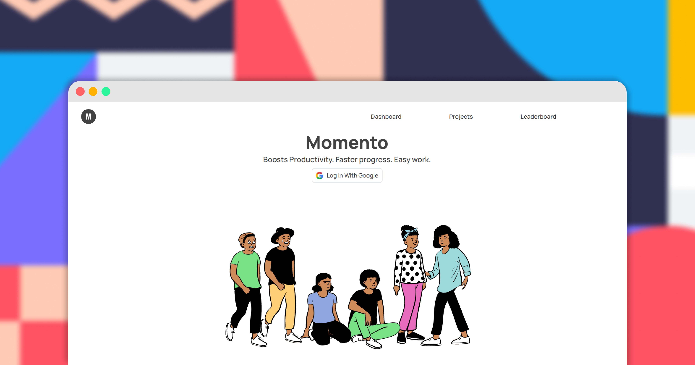

  

<h1 align="center">DevConnect.</h1>

# Introducing Momento

Momento is a productivity app that allows to track the progress of your projects by adding implementations or tasks, resources and keep a track of your work time. It lets you keep focus while working and it has a leadderboard that ranks user based on number of projects completed.

[Read Blog](https://nimalan.hashnode.dev/introducing-momento-a-productivity-app-to-track-the-progress-of-your-projects#heading-flashback)

# 🚀 Demo

[Live Demo](https://momento-app.netlify.app/)

# 📄 Features

- 🏗️ Projects List
- 📃 Add Implementations
- 📄 Add Resources
- ⏳ Focus on work with timer
- 🏆 Leaderboard to rank
- 📊 Stats of the projects
- 📨 Share stats on Twitter

# ⚒️ Tech Stack

- `React` for Frontend
- `Tailwind CSS` for styling
- `Node.js` and `Express.js` for Backend
- `Firebase` for Authentication
- `Axios` for HTTP requests
- `Framer Motion` for animations and transitions
- `MongoDB` for database
- `Netlify` for frontend hosting
- `Heroku` for backend hosting

# 📲 Follow me on

- Twitter: [@nimalancodes](https://twitter.com/nimalancodes)
- Hashnode: [@nimalan](https://hashnode.com/@nimalan)

Leave a ⭐ if you liked and found this useful.

Submission for **Netlify x Hashnode Hackathon**
